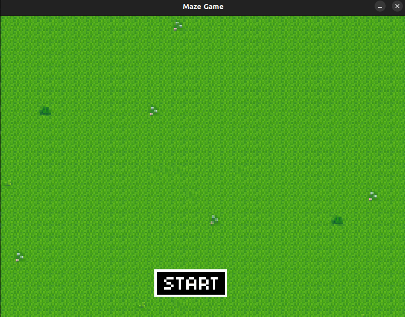
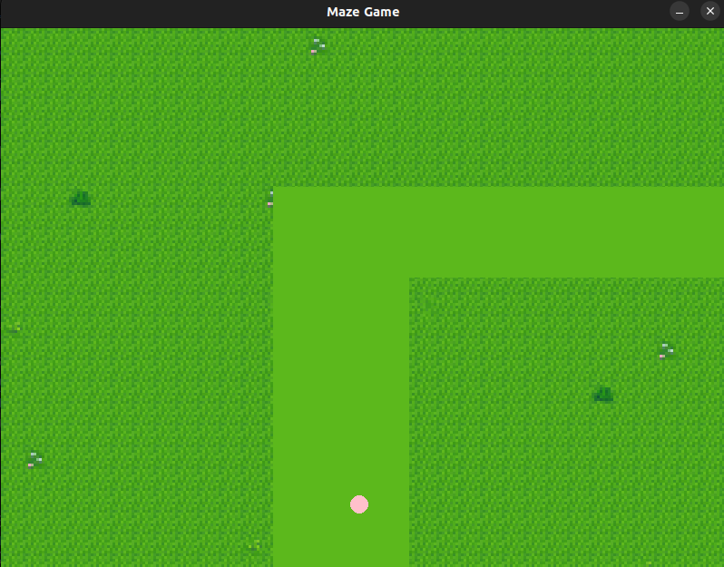

# Maze Prank Game

## The Big Idea

Welcome to Maze Prank Game, a game where your cursor is the player! Enter an adorable field of green grass and flowers. Use your cursor to navigate through the maze and don't touch outside the path, otherwise you'll have to restart.

But there's a surprise waiting somewhere in the field, so don't concentrate too hard! The end is all for 
fun's sake, our team means no harm!

Here's what the game looks like when starting it up:

Here's what the game looks like when the game begins:

Have fun and don't scare your friends too hard! (^_^)

## Fun Facts

* This game is inspired by the viral website Jumpscare Maze Prank Game Online.
* The game's cute visuals are inspired by the game Stardew Valley!

## Our Team

Our team consists of Karis Moon, Khoi Nguyen, and Rishika Chakravorty. Below is a team 
photo!

insert photo here

## GitHub Page

Below is the link to our GitHub page:

[GitHub Repository](https://github.com/olincollege/maze-game)

## How to Download

To download the Maze Prank Game, follow these steps:

1. Navigate to the Maze Prank Game GitHub page.
2. Click on the green "Code" button.
3. Select "Download ZIP" from the dropdown menu.
4. Once the ZIP file is downloaded, extract its contents to a folder on your computer.
5. Open the folder containing the extracted files in your preferred code editor, such as VSCode. Make sure you have Python and Pygame installed on your system.
6. Run the game.py file from the extracted folder to launch the game.

Enjoy playing the Maze Prank Game!

